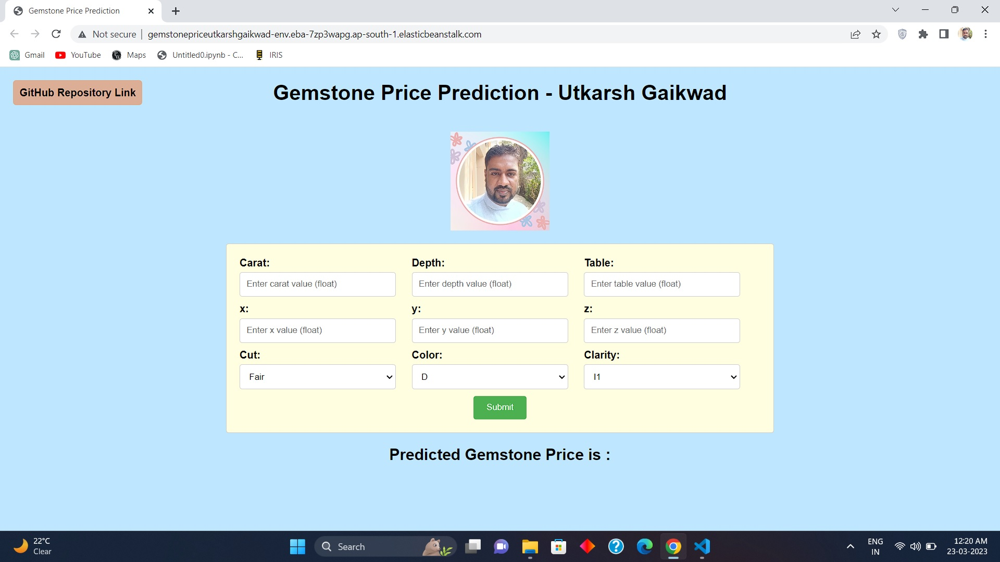
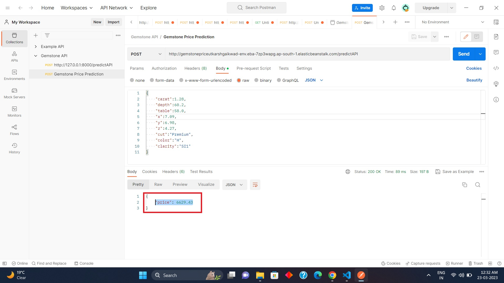

# Gemstone Price Prediction - Utkarsh Gaikwad

### Introduction About the Data :

**The dataset** The goal is to predict `price` of given diamond (Regression Analysis).

There are 10 independent variables (including `id`):

* `id` : unique identifier of each diamond
* `carat` : Carat (ct.) refers to the unique unit of weight measurement used exclusively to weigh gemstones and diamonds.
* `cut` : Quality of Diamond Cut
* `color` : Color of Diamond
* `clarity` : Diamond clarity is a measure of the purity and rarity of the stone, graded by the visibility of these characteristics under 10-power magnification.
* `depth` : The depth of diamond is its height (in millimeters) measured from the culet (bottom tip) to the table (flat, top surface)
* `table` : A diamond's table is the facet which can be seen when the stone is viewed face up.
* `x` : Diamond X dimension
* `y` : Diamond Y dimension
* `x` : Diamond Z dimension

Target variable:
* `price`: Price of the given Diamond.

Dataset Source Link :
[https://www.kaggle.com/competitions/playground-series-s3e8/data?select=train.csv](https://www.kaggle.com/competitions/playground-series-s3e8/data?select=train.csv)

### It is observed that the categorical variables 'cut', 'color' and 'clarity' are ordinal in nature

### Check this link for details : [American Gem Society](https://www.americangemsociety.org/ags-diamond-grading-system/)

# AWS Deployment Link :

AWS Elastic Beanstalk link : [http://gemstonepriceutkarshgaikwad-env.eba-7zp3wapg.ap-south-1.elasticbeanstalk.com/](http://gemstonepriceutkarshgaikwad-env.eba-7zp3wapg.ap-south-1.elasticbeanstalk.com/)

# Screenshot of UI

# YouTube Video Link

Link for YouTube Video : Click the below thumbnail to open 

# AWS API Link

API Link : [http://gemstonepriceutkarshgaikwad-env.eba-7zp3wapg.ap-south-1.elasticbeanstalk.com/predictAPI](http://gemstonepriceutkarshgaikwad-env.eba-7zp3wapg.ap-south-1.elasticbeanstalk.com/predictAPI)

# Postman Testing of API :

# Approach for the project 

1. Data Ingestion : 
    * In Data Ingestion phase the data is first read as csv. 
    * Then the data is split into training and testing and saved as csv file.

2. Data Transformation : 
    * In this phase a ColumnTransformer Pipeline is created.
    * for Numeric Variables first SimpleImputer is applied with strategy median , then Standard Scaling is performed on numeric data.
    * for Categorical Variables SimpleImputer is applied with most frequent strategy, then ordinal encoding performed , after this data is scaled with Standard Scaler.
    * This preprocessor is saved as pickle file.

3. Model Training : 
    * In this phase base model is tested . The best model found was catboost regressor.
    * After this hyperparameter tuning is performed on catboost and knn model.
    * A final VotingRegressor is created which will combine prediction of catboost, xgboost and knn models.
    * This model is saved as pickle file.

4. Prediction Pipeline : 
    * This pipeline converts given data into dataframe and has various functions to load pickle files and predict the final results in python.

5. Flask App creation : 
    * Flask app is created with User Interface to predict the gemstone prices inside a Web Application.

# Exploratory Data Analysis Notebook

Link : [EDA Notebook](./notebook/1_EDA_Gemstone_price.ipynb)

# Model Training Approach Notebook

Link : [Model Training Notebook](./notebook/2_Model_Training_Gemstone.ipynb)

# Model Interpretation with LIME 

Link : [LIME Interpretation](./notebook/3_Explainability_with_LIME.ipynb)
